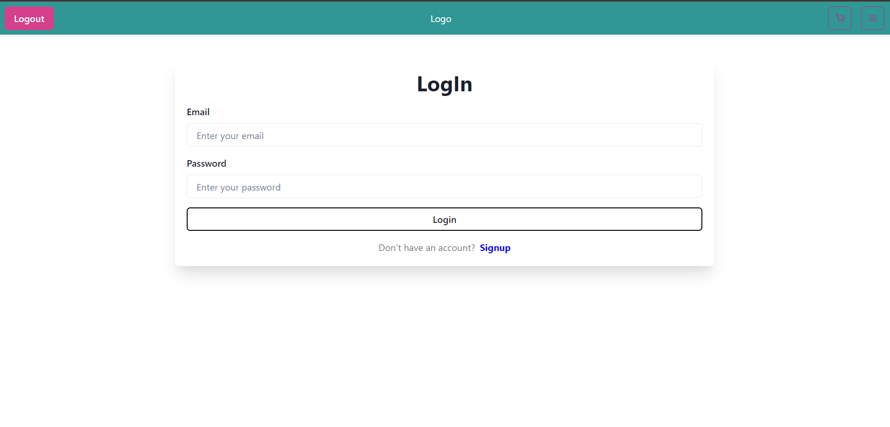
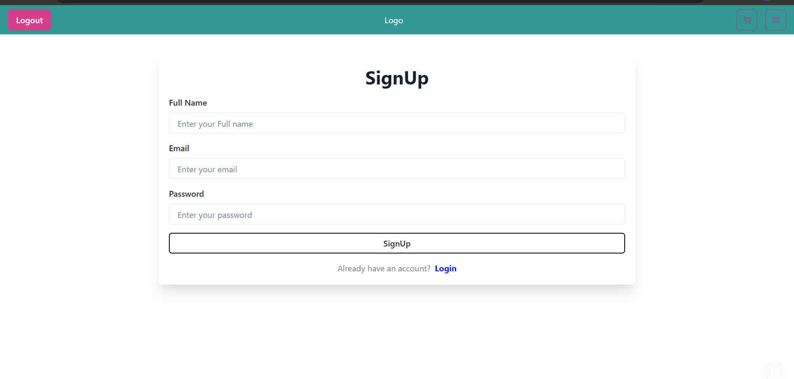
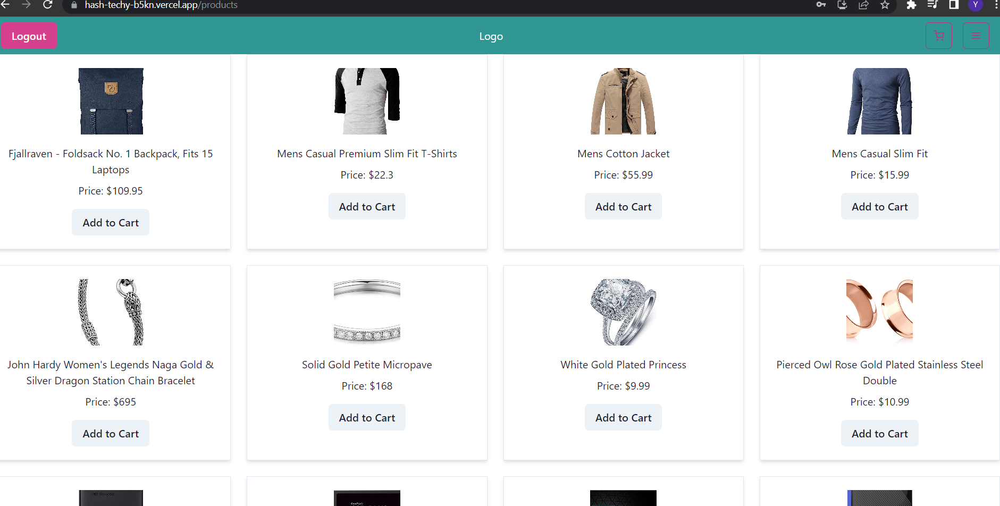
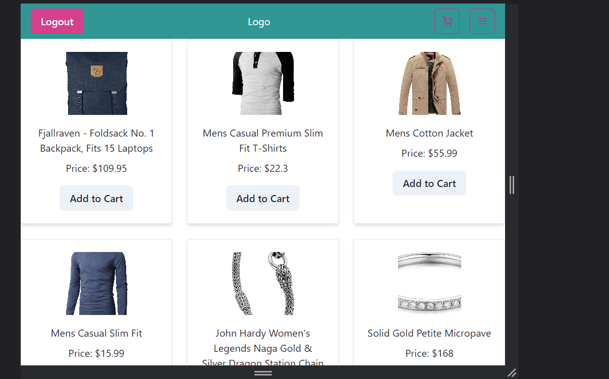
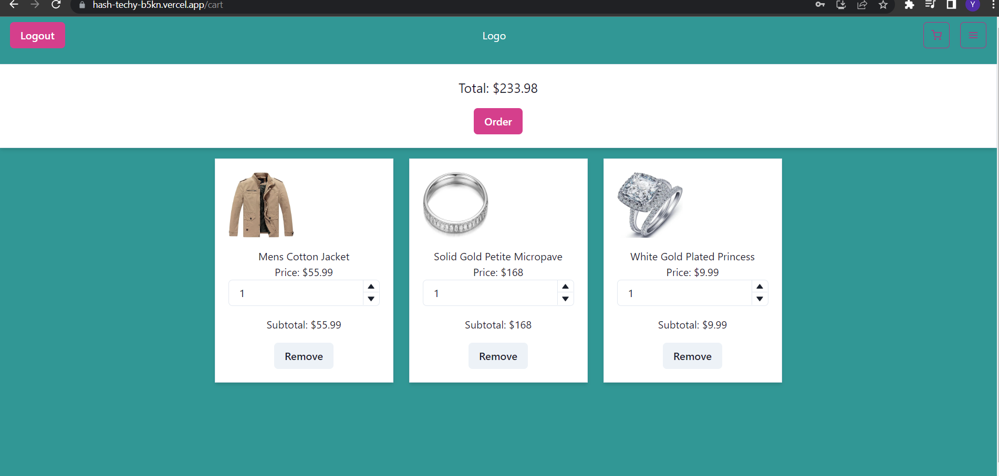
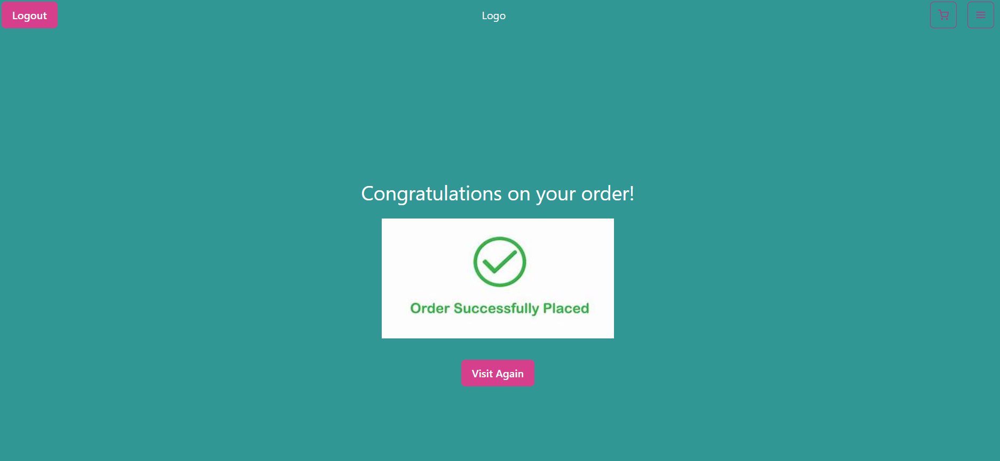
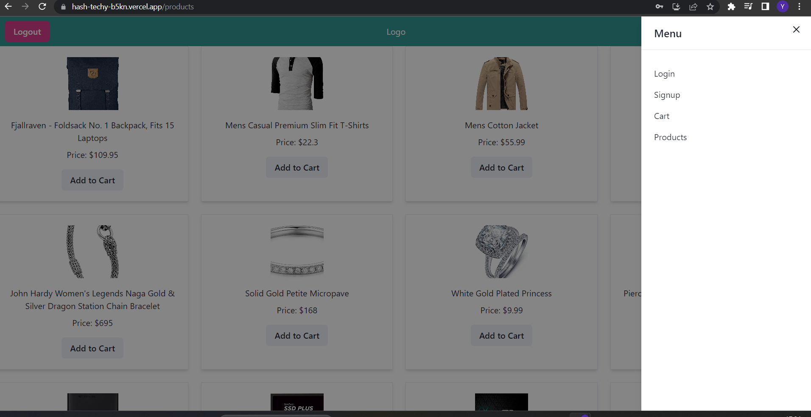

# Hash_Techy

## Deployed Link = https://hash-techy-b5kn.vercel.app/

## Tech Stacks

- React Js

## External libraries and frameworks

- Redux
- Chakra UI
- Some NPM Packages

## Features

- Responsive UI
- Login/signup functionality
- Add to cart functionality

I have Build Signup page and deployed on render but some time it's not working then use this email id and password for login after login user able to see product, cart and order page.

login email id = ## eve.holt@reqres.in  
login password = ## cityslicka

## Landing Page / Login Page

## Signup Page

## Product Page

## Tablet View

## Cart Page

## Order Page

## Side Bar

